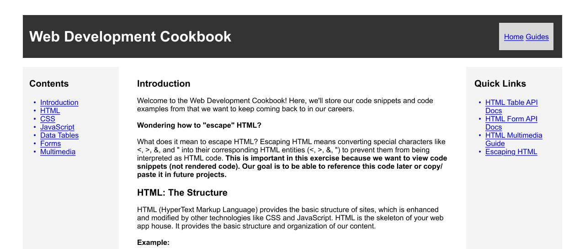

# Assignment: Upgrade Documentation Site

## Introduction

In this assignment, you'll expand an online web development resource with a new page entitled "Guides". The goal of the Guides feature is to explain how to produce complex code.

## Requirements

1. Fill out the listed code blocks in the comments of the index.html
     - Include a couple sentences explaining each code block
2. Create a "Guides" feature by following these sketches to upgrade the application.
3. Create 3 guide sections:
     - Data Tables - implementing sorting, filtering and pagination
     - Complex Forms - implementing form validation
     - Multimedia - implementing adaptive streaming using HLS

**Note**: Use the code from the previous lessons this week. Make sure to explain step-by-step how to produce the feature on the page itself, however.

## Resources

- [MDN Web Docs: HTML Tables Guide](https://developer.mozilla.org/en-US/docs/Learn/HTML/Tables)

## Starter Code

`index.html` and `guides.html` are provided. Ensure to separate out the JavaScript and CSS code to follow the **Seperations of Concerns** principle before beginning.

## Wire Frames

We're aiming to add a new web page to the application called "Guides". This means that we'll want to add a navigation feature to our header and create a new web page that looks similar to the web page we already have. For example, you will create a small navigation panel in the upper-right corner with a link to the Home and Guides page, like so:

You will need to add that navbar to the `guides.html` file as well. In this file, you will find a variety of "TO-DO" comments instructing you on what to add to complete the assignment. Each of the three sections also have a list of requirements for each assignment.

For example, the first section has a TO-DO instructing you to create a specific HTML table, and a list of requirements in a "Step-by-Step Instructions" section that enumerates the functionality you will need to develop using JavaScript to enrich your HTML table.

Once your have written your JavaScript code, you will need to copy the code for each section into the relevant `<code><pre>` blocks so that the text of the code can be displayed in the page itself.

## Deliverables

- A new web page in our web application that displays code examples for our major lessons from this week (e.g. data tables, form validation, adaptive streaming) and a guide - in your own words - about how to produce each feature.
- This page should retain the same header and right sidebar containing Quick Links from the index page, but the left bar should have an updated Contents list with links that jump to the three sections.
- Follow the instruction in the HTML file to add the missing HTML elements and JavaScript functionality.

## Conclusion

The goal of this lesson is to:

1. Build your muscle memory in writing advanced HTML code. We totally understand that these features are advanced. The goal is to implement the features using the code snippets we've already provided - there's no need to create new code.

2. Explain what each code snippet does. The ability to explain complex code is next level for us as web developers. There are many levels before we become masters at a particular subject. The ability to explain and implement complex code patterns is the bar for junior developers.
